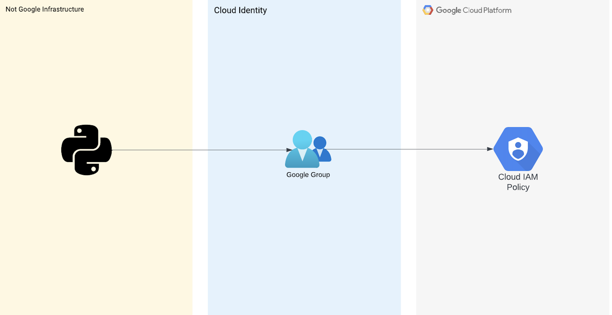

# Google Group Automatic membership expiration
This repository provides a script to call the Cloud identity API to set an amount of time in hours for an identity (human or service accounts) of a Google group. After the time expires, the identity will be removed from the group automatically. Automatic membership expiration can help reduce the administrative overhead for managing groups, and can help ensure group membership is limited to the members that need access.

- Add an identity to a Google group with expiration

## Architecture


## Documentation
- [Automatic membership expiration](https://workspaceupdates.googleblog.com/2021/02/automatic-membership-expiration-google-groups-generally-available.html)

## Usage

Basic usage of this script is as follows:
```
python3 group_expiration_membership.py [-h] --group_id GROUP_ID --member_key MEMBER_KEY [--hours HOURS]

Required arguments:
  --group_id GROUP_ID   The email address of Google Group.
  --member_key MEMBER_KEY The email address of the Google user.

Optional argument:
  --hours HOURS         Hours until expiration of Group membership. The default interger is 8.
  -h, --help            show this help message and exit
```

## Requirements

These sections describe requirements including license and software requirements.

### Authetication
[Application Default Creditials](https://cloud.google.com/docs/authentication/application-default-credentials) was used to demo the script, but for production usage a service account should be used. 

### License

Either Google Workspace Enterprise Standard, Enterprise Plus, G Suite Enterprise for Education, or Cloud Identity Premium.

### Software

The following dependencies must be available:

- [Python][version 3] v3.10
- [Cloud Identity API](https://cloud.google.com/identity/docs/reference/rest)

### APIs

A project with the following APIs enabled must be used to host the
resources of this module:

- Google Cloud Identity: `cloudidentity.googleapis.com`

## Security Disclosures

Please see our [security disclosure process](./SECURITY.md).
